玩lomo的人肯定都知道Holga针孔相机，可是400块一台的价格完全是在抢钱，其实自己DIY一台成本不到10元，当然还需要花上你一天的时间。在开始做之前先做一些准备：

1. 用[google图片](http://www.google.com.hk/imghp)和[flickr](http://www.flickr.com/)搜索 "*pinhole camera*"，这里有网友制作的各式各样的针孔相机，制作零部件的时候可以参考。这里 也有一些设计图纸可以参考尺寸。

2. 去 <http://www.pinhole.cz/en/pinholedesigner/> 下载*pinhole designer*软件，帮你计算合适的孔径以及曝光参数。

3. 准备2-3张A4大小的黑卡纸（400g即可），胶水、刻刀、钢尺、3M黑色胶带、砂纸、可乐罐、针、回形针。

我是一边做一边设计的，需要什么就在卡纸上画个图然后切下来用。首先做的是最简单的成像框，框的大小可以自己设定，标准的是36x24(mm)，但我想要卡孔成像，所以做的是36x35(mm)。在底框上再套个小框，用胶带绑好，试试胶卷滑动是否正常。
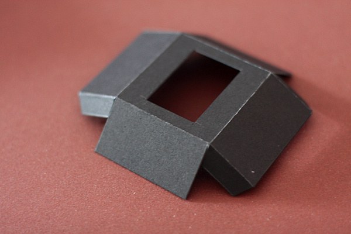
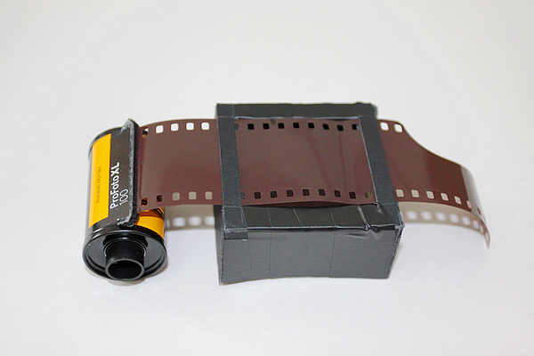
 

然后我们做相机外壳和背板，这个稍微麻烦些，最好先用铅笔在黑卡上画好设计图。
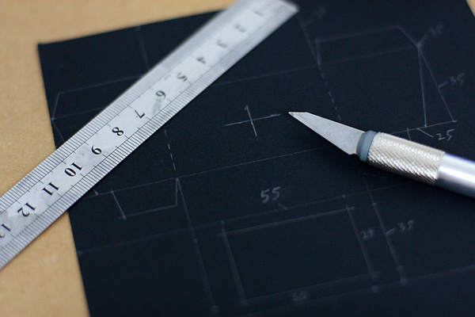

外壳裁下来之后先放到一边，我们来做一些小配件。

上片卷轴我是拿一节铅笔用小螺丝刀在上面转了2个小洞，穿上回形针制成的。而回片转轴就直接是一根回形针用胶布缠了一下。
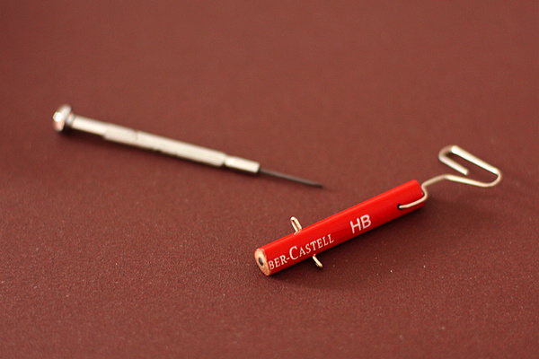
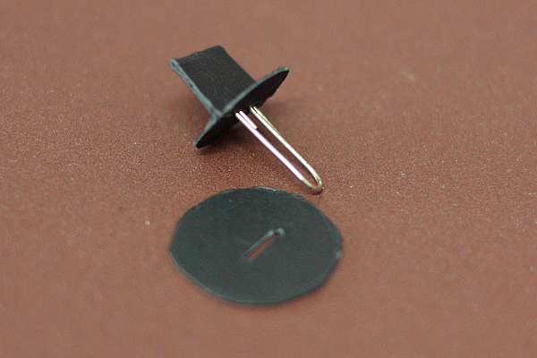
 

接下来是我们最重要的小孔片制作了。剪一小块易拉罐上的铝皮，将它锤平，垫在纸上用圆珠笔在中心用力戳一下。再在砂纸上打磨铝皮反面的小突起，注意不要磨穿，然后用针轻轻扎一下，一个又小又圆的洞就出现了。我们将这块铝皮固定在卡纸上当镜头使用。
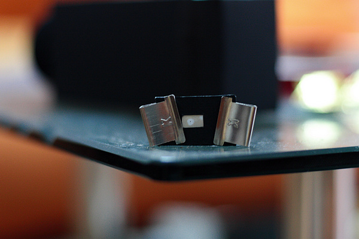

在相机正面用纸条做好快门，固定好刚刚制作的镜头、上片卷轴和回片卷轴。再将成像框固定好。
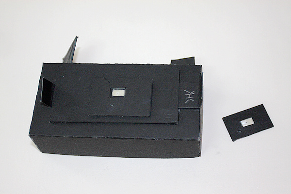

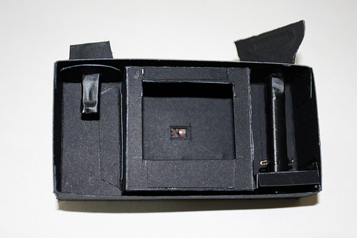

装好胶卷，合上后盖就可以拍摄了。
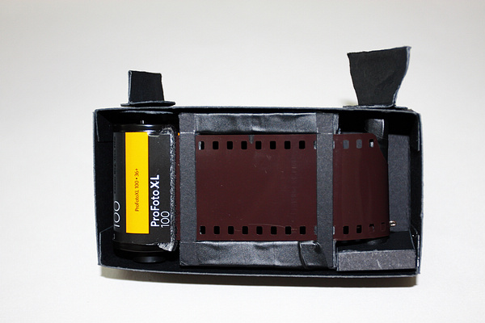

等等，没有取景器怎么拍呢。别急，我们再来做一个取景器。一样的做一个小方盒子，一头直接用针在纸上扎个小洞，另一头挖个框，贴上透明薄纸（类似我们练字的那种，越薄越好，当然你有合适的磨砂玻璃更好）。这样已经可以成像取景了，但在白天这个像非常微弱，基本看不见。我们再用卡纸做个套子遮光即可。从取景器里能看到纸的纹理，不过没有太大影响了。
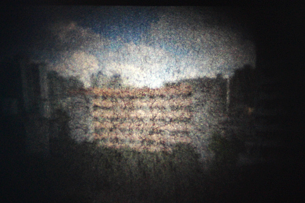

DIY可换镜头针孔相机就这样诞生了。我已经急不可待的要去拍照了。
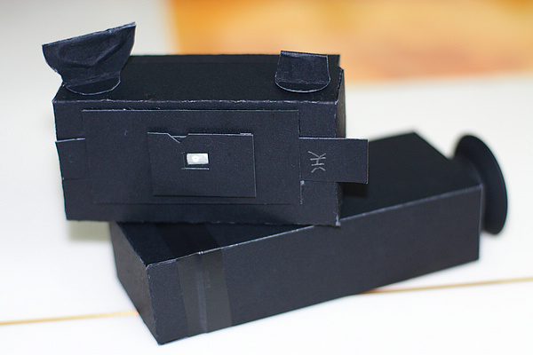

btw：对于lomo摄影，相机的所有缺陷都可以认为是它的功能 ，享受单纯的摄影乐趣就好。

