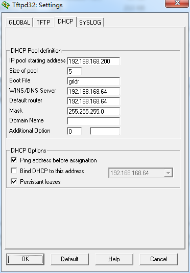

过年回家，我这个在一众亲朋好友眼中的电脑高手总会接到很多修电脑的任务。这一次是台02年的dell笔记本要求重装系统，原系统已被破坏，无法开机。拿到手上顿时觉得坑爹，光驱坏了无法使用，不支持USB引导，唯一能做的引导方式就是PXE了，不管怎样，活还是要干的。

1. 下载 tftpd32 <http://tftpd32.jounin.net/tftpd32_download.html> 
   缺省安装即可。我是安装到目录 f:\tftpd32 

2. 下载 grub4dos  <http://download.gna.org/grub4dos/>
    解压，只需要里面的两个文件：grldr 和 menu.lst 把这两个文件复制到 tftpd32 安装目录 f:\tftpd32 

3. 用文本编辑器（例如 记事本，editplus）打开 menu.lst 文件，注意看里面的启动 iso 文件的格式，把这部分的 iso 文件名改为你的 PE 的ISO 文件名即可。其他的内容可以删除。 这是我的 menu.lst 
		
		timeout 30  
		default /default  
  
		title find and boot WinPE.ISO    
		map /WinPE.ISO (0xff) || map --mem(pd) /WinPE.ISO (0xff)  
		map --hook  
		root(0xff)  
		chainloader (0xff)  
  
		title reboot  
		reboot  

	如果机器内存较小，这里的WinPE.ISO最好选用精简版的。我的这台就是因为只有256M内存，尝试了n个版本之后才能正常启动 

4. 下载 PE 的 ISO, 放到 f:\tftpd32 目录 

5. tftpd32 的设置，就是指定用 grldr 来启动，见下图。 

