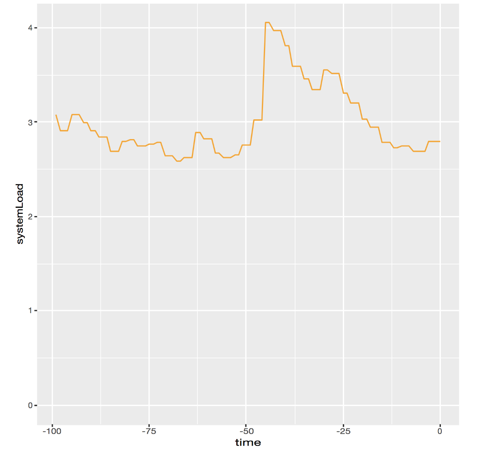

# [译]利用R数据科学增强Java Spring应用

原文： https://medium.com/graalvm/enhance-your-java-spring-application-with-r-data-science-b669a8c28bea[Enhance your Java Spring application with R data science]

NOTE: 原文以 MacOS 上的 GraalVM 企业版为例，翻译时改成了基于 Linux 的 GraalVM 社区版。文章内容有少量修正。

在这篇文章，我们将使用 GraalVM 运行一个简单的 Java 编写的 Spring 应用，并利用 R 语言的函数库 ggplot2 来绘制数据。

GraalVM 是一种多语言虚拟机，能够有效地运行各种语言，如Java、Scala、JavaScript、Ruby、R 和原生语言编译的llvm字节码。

更有趣的是，GraalVM允许你在单个程序中混合语言。Jav、JavaScript、Ruby或R相互调用或在相同的数据上操作，还没有性能损失。让我们研究一下如何在Spring boot应用程序中实现Java和R之间的互操作。

## 为什么我们不能只使一种语言?

每种编程语言都有它自己的生态系统，并适合特定任务。例如，R对于数据处理、数据可视化和机器学习都是很好的。能够自由选择语言，可以让我们用最好的工具简化任务。

例如，我们想要一个具有简单视觉输出的应用程序。在R中绘制数据非常容易，所以我们选择R。ggplot2是一个非常流行的R包，用于绘制各种数据，这听起来就像是正确的工具！

现在，我们不期望每个应用程序都需要数据绘图能力，或者应该立即成为一个多语言应用程序。但我们坚信，每种编程语言都有独特的东西可以提供。而且，重用现有的解决方案比从头重新创建它们更有效。

## Java + R Spring application

本文中使用的示例程序可以从 https://github.com/graalvm/graalvm-demo[graalvm/graalm-demos] 获得。它是一个 Spring boot 应用程序，使用R `ggplot2` 库来渲染当前机器上的CPU负载图。

为了运行示例程序，你需要一个同时支持 Java(JVM bytecode) 和 R 的运行时。

http://www.graalvm.org/downloads/[下载] GraalVM 社区版或企业版都可以，这里我们使用 Linux 社区版。

解压下载的文件，并设置 `GRAALVM_HOME` 指向解压后的目录。

添加 `$GRAALVM_HOME/bin` 到 `$PATH`.

设置 `JAVA_HOME=$GRAALVM_HOME` 确保 Maven 可以访问 `graal-sdk.jar` 中的多语言 API 类。

```bash
export GRAALVM_HOME=/path/to/GraalVM
export JAVA_HOME=$GRAALVM_HOME
export PATH=$GRAALVM_HOME/bin:$PATH
```

克隆 demo 应用并进入 `spring-r` 目录:

    git clone https://github.com/graalvm/graalvm-demos
    cd spring-r

由于这个 Java 应用使用了 `ggplot2` R库，还需要安装 R 语言支持:

    gu -c install org.graalvm.R

如前所述，它还使用了ggplot2，这是一个非常流行的可视化数据包。下面的命令将下载ggplot2依赖的源代码，并将它们编译到 GraalVM 目录下。（注意：这可能需要几分钟时间。）

    Rscript -e "install.packages('ggplot2', repos='http://cran.rstudio.com/')"

现在我们终于可以运行 demo 应用了:

    mvn spring-boot:run

等几秒钟让 Spring 完成初始化，然后就可以在浏览器中访问 `http://localhost:8080/load` 了。

这个页面加载一个svg图像，并且通过 HTTP headers 让浏览器每秒刷新一次。

几秒之后，你会看到像这样的图像:



## GraalVM 中的 Java — R 交互

让我们看代码实现。绘图函数，用R编写，保存在 `plot.R` 文件中。它定义了一个全局变量 `data` 和一个将给定数字追加到 `data` 的函数，然后将 `data` 绘制为svg图像。最后 `svg.off()` 语句将svg图像作为字符串返回。

```R
library(ggplot2)
data <<- numeric(100)  # 创建长度100的double型vector
function(v) {
  svg()                # 打开svg设备
  data <<- c(data[2:100], v)  # 用后99个数和新值创建新数据集合
  plot <- ggplot(data = data.frame(systemLoad = data, time = -99:0),
  aes(x=time, y=systemLoad, group=1)) +  # time为横坐标，systemLoad为纵坐标
  geom_line(color="orange") +    # 绘制线图
  expand_limits(x=0, y=0)        # 固定坐标原点，避免坐标轴的自动截取
  print(plot)          # 输出到svg设备
  svg.off()            # 关闭svg设备并返回  
}
```

那么我们如何在Java中使用这个函数呢？由于我们编写的是Spring应用，所以我们可以定义GraalVM的交互组件为Spring bean。要使用GraalVM 多语言功能，我们需要为使用的动态语言定义一个上下文（实际上GraalVM中的所有语言的交互方式都是类似的）。

```java
@Bean
public Context getGraalVMContext() {
  return Context.newBuilder().allowAllAccess(true).build();
}
```

接下来，我们使用这个 context 执行我们的 R 文件。由于文件中最后执行的是一个函数定义，它会作为 `ctx.eval()` 的结果返回，所以我们可以转换这个返回值为 `java.util.Function` 实例。

```java
@Value(value = "classpath:plot.R")
private Resource rSource;

@Bean
Function<Double, String> getPlotFunction(@Autowired Context ctx)
throws IOException {
  Source source = Source.newBuilder("R", rSource.getURL()).build();
  return ctx.eval(source).as(Function.class);
}
```

为了让我们的应用访问 R 文件，我们将文件放在了属于类路径的 `resources` 目录，然后通过 `@Value` 注解 `Resource` 字段来配置对它的访问。

现在到了最棒的部分，在一个单独的R文件中定义的R函数被作为一个普通的 Spring bean 暴露，因此我们可以直接声明对应类型的属性，并通过Spring依赖注入机制设值。

```java
@Autowired
private Function<Double, String> plotFunction;
```

当应用初始化的时候，`plotFunction` 字段将会被设置为 R 源文件的执行结果。代码其余部分则很简单，我们在控制器中定义了一个 RequestMapping，它将 `plotFunction` 函数生成的svg文件返回到浏览器：

```java
@RequestMapping(value = "/load", produces = "image/svg+xml")
public ResponseEntity<String> load() {
  HttpHeaders responseHeaders = new HttpHeaders();
  responseHeaders.set("Refresh", "1");
  return new ResponseEntity<String>(
     plotFunction.apply(
       ManagementFactory.getOperatingSystemMXBean()
                        .getSystemLoadAverage()),
     responseHeaders,
     HttpStatus.OK);
}
```

在这段代码中有些有意思的地方。执行过程中，我们跨越语言障碍从Java到R再回到Java。请注意 `plotFunction` 函数接受一个普通的 Java double 作为参数，并返回一个普通的 Java 字符串。R代码自动处理这些值，而不需要手工转换。

例如，我们将一个DataHolder对象传递给R：

```java
public static class DataHolder {
  public double value;
  public DataHolder(double v) {
    value = v;
  }
}
```

在R中，使用常规的R字段访问方式直接访问DataHolder的值：

```R
function(dataHolder) {
  svg()
  data <<- c(data[2:100], dataHolder$value)
  ...
}
```

其他操作也是类似的，例如我们希望通过一个统一的 Java 日志对象记录全部日志。

假设有如下日志对象：

```java
public class LogHolder {
private static final Log LOG =   
                   LogFactory.getLog(SpringRApplication.class);
public static void log(double value, Object... args) {
  LOG.info(String.format("Logging (value = %s): %s", value,        
                                        Arrays.toString(args)));
  }
}
```

下面的代码段显示了如何在 R 中调用 Java `LogHolder` 类型的静态 `log` 方法:

```R
logHolder <- java.type("org.graalvm.demos.springr.LogHolder")
logHolder$log(dataHolder$value, data[90:100])
```

非常棒，对吧。

## 结语

在本文中，我们讨论了用另一种语言 R 来编写代码增强一个普通的Java应用程序。每种编程语言都有它自己的生态系统，并且对某些问题非常有用。我们使用了一个普通的Spring boot应用程序，并添加了一个小的R脚本，以生成CPU负载图。将它们绑定在一起是相当简单的，因为GraalVM允许您将动态语言的成员导出为Spring bean。

我们非常想知道您想从其他语言的生态系统中添加什么到Java应用程序中，并尝试使用GraalVM实现它。如果你有想法或问题，请举手！ https://twitter.com/shelajev[@shelajev] 总是乐于聊天，ping他吧。

如果你想知道GraalVM还能做什么，请阅读Chris Seaton的博客文章 https://medium.com/graalvm/graalvm-ten-things-12d9111f307d[“GraalVM可以做的10件事”]。

## TL;DR

Marvel: “无限战争”是史上最有野心的跨界事件。

GraalVM 笑了: 要不要看看 R 中的 Spring bean.

```java
@Value(value = "classpath:plot.R")
private Resource rSource;

@Autowired
private Function<Double, String> plotFunction;

@Bean
Function<Double, String> getPlotFunction(@Autowired Context ctx) throws IOException {
    Source source = Source.newBuilder("R", rSource.getURL()).build();
    return ctx.eval(source).as(Function.class);
}

@RequestMapping(value = "/load", produces = "image/svg+xml")
public ResponseEntity<String> load() {
  HttpHeaders responseHeaders = new HttpHeaders();
  responseHeaders.set("Refresh", "1");
  return new ResponseEntity<String>(
     plotFunction.apply(
       ManagementFactory.getOperatingSystemMXBean()
                        .getSystemLoadAverage()),
     responseHeaders,
     HttpStatus.OK);
}
```
