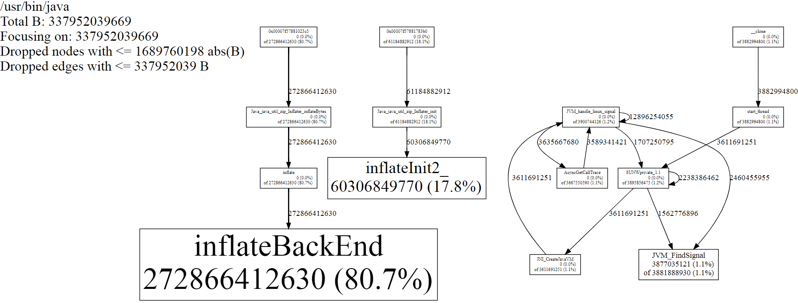

# 分析 Java 内存泄漏

:numbered:

http://chenhm.com[Chen Hongming]

## Java 内存分类

- Heap
    * Eden
        ** TLAB ( Thread Local Allocation Buffers )
    * Survivor
    * Old
- Non-heap
    * Permanent generation: JAVA 1.8 中已经被 Metaspace 代替
    * Metaspace
    * direct buffer
    * mapped buffer
- Stack
- PC register
- Native method stack

## 分析策略


### 堆内内存

堆内泄漏是最简单的一种情况，我们可以直接通过 `jstat -gc <pid> 2000` 或 `jconsole`,`jvisualvm` 这样的可视化工具观察到内存增长状态，
确定内存增长不正常之后，通过 `jcmd <PID> GC.heap_dump heap.bin` 生成 heap dump 文件，然后使用 https://www.eclipse.org/mat/[MAT] 或 http://www-01.ibm.com/support/docview.wss?uid=swg27006624&aid=1[IBM Heap Analyzer] 分析 Heap 中的对象关系，很容易找到堆内不正常的对象。

另一个很好用的工具是 https://docs.oracle.com/javacomponents/jmc-5-4/jfr-runtime-guide/run.htm[Java Flight Recorder (JFR)]，可以看到内存增长统计。

### 堆外内存

堆外空间的统计主要依赖 https://docs.oracle.com/javase/8/docs/technotes/guides/troubleshoot/tooldescr007.html["Native Memory Tracking" (NMT)]
和强大的 http://openjdk.java.net/groups/hotspot/docs/Serviceability.html#bsa[HotSpot Serviceability Agent], 例如R大之前就写过一些基于 SA 的小工具 https://rednaxelafx.iteye.com/blog/1814429

### 内存虚段

有时我们会发现进程占用了较高的虚地址空间，即 `top` 的 VIRT 或 `ps aux` 的 VSZ 空间。
```
  PID USER      PR  NI    VIRT    RES    SHR S  %CPU %MEM     TIME+ COMMAND
11456 root      20   0 17.344g 8.814g  18048 S   0.7  9.3  20:12.61 java
```
通常而言我们不用担心 VIRT 空间，如果确实 VIRT 很大而 RES 正常，可以通过 MALLOC_ARENA_MAX 环境变量限制 glibc 的预分配段。

### Native method 内存

由于 native method 的执行不受 JVM GC管理，在这里发生的内存泄漏无法通过 Java 自带工具观察。
这时需要通过 malloc_hook 追踪 malloc 的调用链，但我们有个更简单的方法，
那就是使用分配器 https://github.com/jemalloc/jemalloc[jemalloc] 代替 glibc 中的 malloc 实现，
利用 jemalloc 的 Profiling 功能分析内存分配过程。

1. 从 https://github.com/jemalloc/jemalloc/releases 下载最后版本的 jemalloc 源码

2. 解压后执行 `./configure --enable-prof && make` 编译代码

3. 设置环境变量让 jemalloc 生效
+
```
export LD_PRELOAD=$JEMALLOC_DIR/lib/libjemalloc.so
export MALLOC_CONF=prof:true,lg_prof_interval:30,lg_prof_sample:17
```

4. 启动 JAVA 进程重现内存泄漏过程，这时在当前目录可以看到大量 jeprof 开头的 heap 文件，执行如下 jeprof 生成统计图表。
+
```
$JEMALLOC_DIR/bin/jeprof --show_bytes --svg /usr/bin/java jeprof*.heap > app-profiling.svg
```


5. 例如上面的统计图我们发现一个 Java native method `Java_java_util_zip_Inflater_inflateBytes` 上进行了大量内存分配，现在需要找出是哪里调用了这个方法。
对于 Java 来说查看调用链最简单的方法就是创建 thread dump，我写了下面这个小脚本不断创建 thread dump 直到找到指定的方法调用栈。

+
.dump_leak_thread.sh
```bash
#!/usr/bin/bash
PID=`jcmd |grep $1|awk '{print $1}'`
if [ -z $PID ]; then
 echo "Not found process matching pattern: $1"
 exit
fi
echo "find pid: $PID"
touch leak_thread.dump
while ! grep "$2" leak_thread.dump > /dev/null; do
  echo "jcmd $PID Thread.print > leak_thread.dump"
  jcmd $PID Thread.print > leak_thread.dump
done
```

通过上面的方法我们可以找到 native method 中发生的内存泄漏，
但其实我们多次发现类似的故障都是由于 java zip 包中的 Inflater 实现问题导致，如果多次读取 jar 包中的文件但没及时关闭，将会面临内存异常消耗的问题。
如果你的代码中并没有使用 JNI 却发生了 native method 内存泄漏，可以试试直接执行上面的脚本查找调用栈
`./dump_leak.sh <PROCESS_NAME> inflate`。

如果确定是 Inflater 的问题，除了修改代码避免问题之外，还可以通过 `-XX:+UseG1GC` 启用 G1 垃圾回收器避免问题扩大。
G1能够更有效的回收 heap 中的无效对象，比如未close的stream会被相对及时回收，使内存泄漏最终控制在一个可控范围。

### 参考
- https://gdstechnology.blog.gov.uk/2015/12/11/using-jemalloc-to-get-to-the-bottom-of-a-memory-leak/[Using jemalloc to get to the bottom of a memory leak]
- http://www.evanjones.ca/java-native-leak-bug.html[Debugging Java Native Memory Leaks]
- http://openjdk.java.net/groups/hotspot/docs/Serviceability.html#bsa
- https://stackoverflow.com/questions/36588354/how-to-dump-java-objects-came-from-jvm-heap-old-generation
- https://shipilev.net/jvm-anatomy-park/
