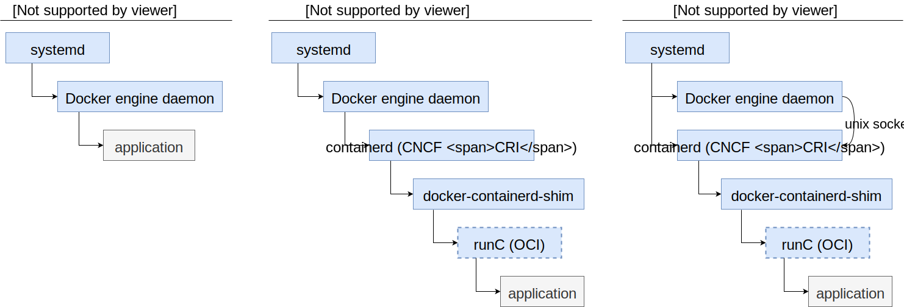
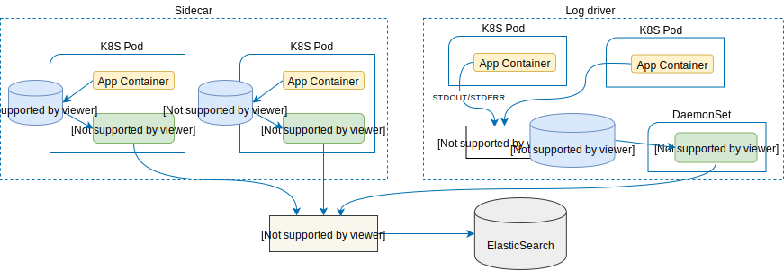
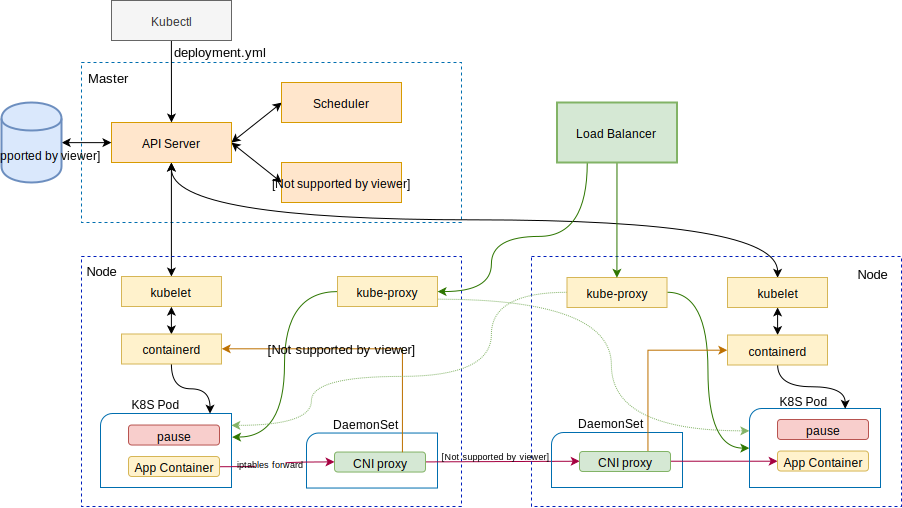
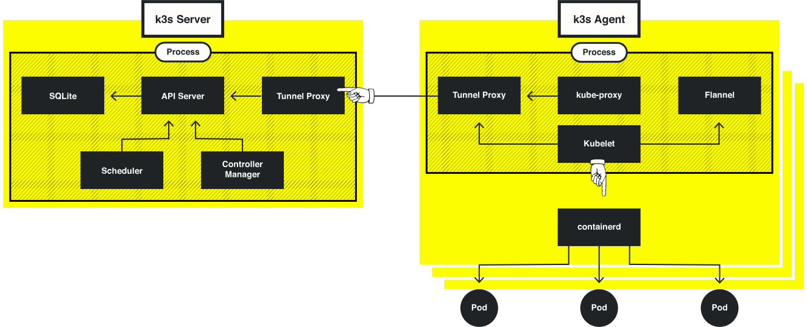

# Kubernetes 入门

## Core concepts

Kubernetes(k8s)  是当前最主流的容器编排工具，它采用声明式的容器管理机制，用户在描述文件里定义期望的系统状态，k8s会监控整个集群，并努力达到用户所描述的状态。这篇指引会从基础概念入手，介绍k8s的基本功能，并在最后解释k8s的一些实现原理。

### Docker

在理解docker之前我们需要先理解一个概念——Linux内核。我们通常说的linux操作系统包含了linux内核以及内核之上建立的运行在user space各种系统服务。内核负责进程调度、内存管理、文件系统、网络堆栈、设备驱动等功能。但通常我们不直接跟内核打交道，例如 JVM 使用 libc 的 `malloc()` 方法分配内存，而不是直接使用系统调用 `brk()` 或 `mmap()`，这样可以利用 libc 的内存管理机制，简化内存管理过程。

很多人将docker理解为轻量级虚拟机或一种应用打包方式，docker其实是linux内核之上的一个隔离执行环境。所以我们打包 JVM 的时候必须一同打包包含了标准C库实现的某种linux发行版，例如redhat 7 image包含glibc，alpine image 包含 musl libc，frolvlad/alpine-java 则是基于包含 glibc 的 alpine。与之对应， Go 语言的runtime自带内存管理，不依赖标准C，又通常使用静态链接，这样就可以直接在内核上执行，打包docker image就无需再包含linux系统了。

有些时候 pull 下来的 image 似乎无论 x86、arm、linux、windows 都可以用，其实是背后有针对多种架构和操作系统内核的多个 image，`docker pull` 的时候自动拉了对应版本。

容器主要使用了内核中的2个技术点

- Namespace：namespace可以实现Process ID，Mount，IPC，Network，User的访问隔离，这也是容器能实现隔离的基础。
- Cgroup：cgroup(control group) 实现了CPU、Memory、Network Bandwidth、Disk、Priority等资源的控制，通过限制资源使用，降低容器之间的互相影响。

早期的时候，Docker的结构是很简单的，docker命令行工具向docker daemon发送指令，docker daemon负责镜像拉取，容器资源管理，生命周期管理等等。但随着容器技术的发展，社区希望不同的容器引擎能互相兼容，比如拉下来的image在所有引擎里面都能正确执行，于是docker和coreos发起建立了OCI规范，docker将自己的容器引擎runc捐献给了OCI。另一方面，k8s希望能以标准化的方式集成不同的容器引擎，于是定义了CRI规范，后来Docker将自己的CRI实现containerd捐赠给了CNCF，并利用containerd实现docker自身的容器生命周期管理。



Docker在containerd和runc之间还引入了containerd-shim，当runc启动容器后，runc自身退出，application由containerd-shim接管。这样不管runc还是containerd或是docker daemon退出了，容器仍然可以正常运行，实现不停容器的情况下升级docker，进一步的解释可以看[这里](https://github.com/crosbymichael/dockercon-2016/blob/master/Creating%20Containerd.pdf) 。

### Pod

我们知道容器之间是互相隔离的，但有些应用却是紧耦合的，需要共享网络、内存、存储等等，或者基于性能考虑不能跨主机访问。k8s于是提出了pod这个概念，将同一主机同一namespace下的容器打包部署，pod是k8s部署、水平伸缩的最小单位。

### Service

因为Pod面临宕机、滚动升级、Scale out/in等影响访问性的情况，K8s提供了service这一层抽象，以实现服务访问的高可用。Service 类似一个反向代理，每个service会被分配一个集群内可用的VIP(Cluster IP)，然后根据pod的label将端口路由到可用的pod上。其实现方式有以下几种：

- **kube-proxy**：k8s在每个节点上运行 kube-proxy 模块，kube-proxy 直接在userspace进行 layer 4(TCP/UDP over IP) 转发。这种模式实现简单但效率不高。
- **iptables**：kube-proxy 模块通过设置 iptables 规则实现包转发，效率更高，是目前的默认方式。
- **ipvs**：从1.8.0开始，k8s引入了LVS作为service的负载均衡器，性能更好，并且可以选择 LB 算法。

还有一种特殊的 **Headless** service，并不分配 Cluster IP，即设置 `spec.clusterIP: None`，这样就跳过了 service 自带的  load-balancing，可以在客户端自己实现 LB 策略。

如果想从集群外部访问service，Cluster IP是不能满足要求的，我们还需要选择以下一种**Service Type**：

- `NodePort`: 在每个节点上起一个固定的端口监听并转发服务。这是最常用的一种模式。

- `LoadBalancer`: 需要依赖云服务厂商的 load balancer 服务。

- `ExternalName`: 用于访问集群外部服务的情况。设置 `spec.externalName: my.example.com`，当查找该服务的时候，cluster DNS将会返回 CNAME 记录 my.example.com，然后走上级DNS查找即可。

### DNS

基于Cluster IP访问service显然不便，通常在集群内还有DNS服务，服务名会按以下规则注册。

- Services
  - A 记录
    - **Normal** my-svc.my-namespace.svc.cluster.loca -> cluster ip
    - **Headless** my-svc.my-namespace.svc.cluster.local -> endpoints ip
  -  SRV 记录： 命名端⼝ _my-port-name._my-port-protocol.my-svc.my-namespace.svc.cluster.local
- Pods
  - A 记录 pod-ip-address.my-namespace.pod.cluster.local

例如以下命令可以查询kubernetes service的Cluster IP

```
nslookup kubernetes.default.svc.cluster.local 10.96.0.10
```

在同一 namespace 下的服务可以直接通过服务名访问，否则需要带上 namespace。

### Ingress

Ingress定义了L7的HTTP/HTTPS负载均衡策略，它可以提供 LB、TLS termination(and SNI)、virtual host、URL map 这些工作在 L7 上的规则。第三方的 **Ingress controller** 会解析这些规则，并应用到 L7 LB 上。k8s 自身维护了一个基于 nginx 的 ingress controller，这个实现本身也是 LB ，它可以通过LoadBalancer或NodePort暴露到外部，详细可参考[这里](https://kubernetes.github.io/ingress-nginx/deploy/baremetal/) 。

简单来说 service 处理 L4 负载均衡，ingress 处理 L7 负载均衡，但很多负载均衡其实同时支持 L4 和 L7，最终的处理设备可能是同一个。

## Install

### minikube

`minikube` 可以快速创建一个单节点的k8s测试环境，它默认使用 virtualbox 作为虚拟化层，需要在 host 上安装 virtualbox，但也支持几乎所有的虚拟化软件。其工作流程大致如下：

1. 下载 Minikube ISO，这是个类似 boot2docker.iso 的镜像，包含了一个最小化的linux和docker运行环境。
2. 基于这个ISO，调用虚拟化层创建一个虚拟机。
3. 在这个虚拟机中执行 `kubeadm` 创建k8s服务，`kubeadm`会以docker容器的形式将单节点k8s的所有服务拉起来。

如果已经有了包含docker的linux环境，那就没必要再创建虚拟化层，这时可以使用 `minikube start --vm-driver none`直接初始化k8s。下面的脚本演示了在CentOS 7上通过 minikube 拉起k8s的方法。

```bash
cat <<EOF >  /etc/sysctl.d/k8s.conf
net.bridge.bridge-nf-call-ip6tables = 1
net.bridge.bridge-nf-call-iptables = 1
EOF
sysctl --system

systemctl disable firewalld
systemctl stop firewalld

yum install socat -y
curl -Lo minikube https://storage.googleapis.com/minikube/releases/v1.0.0/minikube-linux-amd64 && chmod +x minikube
curl -Lo kubectl https://storage.googleapis.com/kubernetes-release/release/v1.14.0/bin/linux/amd64/kubectl && chmod +x kubectl && mv kubectl /usr/local/bin/
export no_proxy="10.0.2.15,localhost,127.0.0.1"
./minikube start --docker-env="http_proxy=http://192.168.56.1:1080" --docker-env="https_proxy=http://192.168.56.1:1080" --docker-env="no_proxy=localhost,127.0.0.1" --vm-driver none
```

k8s 提供了一个比较好用的 dashboard 查看它的运行状态，使用下面的脚本开启dashboard之后，使用浏览器访问本机9090端口即可。
```bash
minikube addons enable dashboard
minikube addons enable heapster  #enable statistical graphs in dashboard
kubectl port-forward service/kubernetes-dashboard 9090:80 --address 0.0.0.0 -n kube-system
```

现在我们启动一个简单的echo服务验证下k8s的功能

```bash
kubectl run echo --generator=run-pod/v1 --image=alpine/socat -- PIPE tcp-listen:1234,fork
```

找到该pod的ip地址

```bash
$> kubectl get pod -o wide
NAME    READY   STATUS    RESTARTS   AGE   IP           NODE
socat   1/1     Running   0          14s   172.17.0.6   minikube
```

然后使用 `telnet 172.17.0.6 1234` 连上pod，发送任意消息，可以看到echo回来的重复数据。

结束后清理环境 `kubectl delete pod/echo` 。

### kubeadm

kubeadm是最主要的Kubernetes部署工具之一，它可以帮助完成k8s集群的初始化。 `kubeadm` 依赖 `kubelet` 来启动Master组件， `kubelet` 运行在集群的每个节点上用于启动Pod，同时我们还需要 `kubectl` 来管理集群。详细安装步骤参考 https://kubernetes.io/docs/setup/independent/install-kubeadm/#installing-kubeadm-kubelet-and-kubectl，这里我提供了几个脚本帮助在 CentOS 7 上安装 K8s。

#### Install kubeadm

Google提供了yum仓库可以直接安装kubeadm和相关依赖

```bash
cat <<EOF > /etc/yum.repos.d/kubernetes.repo
[kubernetes]
name=Kubernetes
baseurl=https://packages.cloud.google.com/yum/repos/kubernetes-el7-x86_64
enabled=1
gpgcheck=1
repo_gpgcheck=1
gpgkey=https://packages.cloud.google.com/yum/doc/yum-key.gpg https://packages.cloud.google.com/yum/doc/rpm-package-key.gpg
EOF
setenforce 0
yum install -y kubelet kubeadm kubectl

# for RHEL/CentOS 7
cat <<EOF >  /etc/sysctl.d/k8s.conf
net.bridge.bridge-nf-call-ip6tables = 1
net.bridge.bridge-nf-call-iptables = 1
EOF
sysctl --system

# enable read-only port for heapster
sed -i 's/KUBELET_EXTRA_ARGS=/KUBELET_EXTRA_ARGS=--read-only-port 10255 /' /etc/sysconfig/kubelet

systemctl enable kubelet && systemctl start kubelet
```

#### Startup kubernetes

初始化k8s master节点最简单的方法就是直接执行 `kubeadm init`  ，这个命令会执行一系列的步骤：

- 系统状态预检查
- 生成自签名CA并签名每个组件
- 生成kubeconfig用于kubelet连接API server
- 为Master组件生成Static Pod manifests，并放到 /etc/kubernetes/manifests 目
录中，kubelet会监视这个目录并初始化Pod
- 配置RBAC并设置Master node只运行控制平面组件
- 创建附加服务，比如 kube-proxy 和 kube-dns

下面的脚本我们在 `init` 的时候启用了一些扩展API供后面使用。 `init` 后的集群还需要安装网络插件CNI用于集群网络管理，这里我们使用WeaveNet的CNI实现。最后为了便于查看集群状态，我们还安装了Kubernetes Dashboard，并用NodePort的形式将它暴露到本地的30443端口。

*startup-kube.sh*

```bash
#kubeadm config images pull
swapoff -a
#CentOS firewalld is completely incompatible with kubernetes
systemctl disable firewalld
systemctl stop firewalld

# disable SELinux to prevent any communication issues on all the nodes
setenforce 0
sed -i 's/^SELINUX=enforcing$/SELINUX=permissive/' /etc/selinux/config

EXTRA_IP=`ip a|grep -Eo 'inet (addr:)?([0-9]*\.){3}[0-9]*' | grep -Eo '([0-9]*\.){3}[0-9]*' | grep 192`

cat <<EOF > kubeadm.conf
apiVersion: kubeadm.k8s.io/v1beta1
kind: ClusterConfiguration
controlPlaneEndpoint: "$EXTRA_IP:6443"
apiServer:
  certSANs:
  - "$EXTRA_IP"
  extraArgs:
    enable-admission-plugins: NamespaceLifecycle,LimitRanger,ServiceAccount,NodeRestriction,PersistentVolumeLabel,DefaultStorageClass,DefaultTolerationSeconds,MutatingAdmissionWebhook,ValidatingAdmissionWebhook,ResourceQuota,PodPreset
EOF

export {http,https}_proxy=http://192.168.56.1:1080
curl -L -o cni.yaml "https://cloud.weave.works/k8s/net?k8s-version=$(kubectl version |
base64 | tr -d '\n')"
curl -L -o kubernetes-dashboard.yaml "https://raw.githubusercontent.com/kubernetes/dashboard/v1.10.1/src/deploy/recommended/kubernetes-dashboard.yaml"
unset http_proxy
unset https_proxy

kubeadm init --config=kubeadm.conf

cat <<EOF >> kubernetes-dashboard.yaml
---
# ------------------- Dashboard Service ------------------- #

kind: Service
apiVersion: v1
metadata:
  labels:
    k8s-app: kubernetes-dashboard
  name: kubernetes-dashboard
  namespace: kube-system
spec:
  ports:
    - port: 443
      targetPort: 8443
      nodePort: 30443
  type: NodePort
  selector:
    k8s-app: kubernetes-dashboard
EOF

export KUBECONFIG=/etc/kubernetes/admin.conf

# modprobe -a ip_vs ip_vs_rr ip_vs_wrr ip_vs_sh

# sysctl net.bridge.bridge-nf-call-iptables=1
kubectl apply -f cni.yaml

# Allowing pod scheduling on the master node
kubectl taint nodes --all node-role.kubernetes.io/master-

kubectl apply -f kubernetes-dashboard.yaml
```

等待Pod启动完成后可以通过 https://host:30443 访问dashboard。

#### Setup account & RBAC

在上一步访问dashboard的时候会发现提示访问token，这是因为刚创建好的k8s还没有访问账号， [这里](https://github.com/kubernetes/dashboard/wiki/Creating-sample-user) 有个简单的账号设置官方示例。

*user.yaml*

```yaml
apiVersion: v1
kind: ServiceAccount
metadata:
  name: admin-user
  namespace: kube-system
---
apiVersion: rbac.authorization.k8s.io/v1
kind: ClusterRoleBinding
metadata:
  name: admin-user
roleRef:
  apiGroup: rbac.authorization.k8s.io
  kind: ClusterRole
  name: cluster-admin
subjects:
- kind: ServiceAccount
  name: admin-user
  namespace: kube-system
---
kind: Role
apiVersion: rbac.authorization.k8s.io/v1
metadata:
  namespace: default
  name: pod-and-pod-logs-reader
rules:
- apiGroups: [""]
  resources: ["pods", "pods/log"]
  verbs: ["get", "list"]
---
apiVersion: rbac.authorization.k8s.io/v1
kind: RoleBinding
metadata:
  name: admin-user-log
roleRef:
  apiGroup: rbac.authorization.k8s.io
  kind: Role
  name: pod-and-pod-logs-reader
subjects:
- kind: ServiceAccount
  name: admin-user
  namespace: kube-system
```

执行以下脚本设置RBAC并获取访问Token。

```bash
kubectl apply -f user.yaml

kubectl create clusterrolebinding my-cluster-admin \
 --clusterrole=cluster-admin \
 --user=system:serviceaccount:default:default
 
kubectl -n kube-system describe secret $(kubectl -n kube-system get secret | grep admin-user | awk '{print $1}')
```

#### Setup worker node
在 master 上执行 `kubeadm token list` 获得 token，然后在 worker 节点上执行 `kubeadm join` 加入集群。 
```bash
kubeadm join --discovery-token-unsafe-skip-ca-verification --token ii0g3n.1jpikf8drapdi1h9 <master>:6443 --node-name worker1
```

## Application deployment
### Deployments

虽然 `kubeectl run` 可以创建一个 Pod 或 Deployment，但通常会使用 yaml 文件描述Pod、Service、Ingress等等相关资源，然后利用 `kubectl apply -f httpd.yaml`  完整部署，以后修改了也可以再次执行 `kubectl apply` 自动更新修改的部分。例如下面这个 yaml 使用 busybox 启动了一个监听在 8080 的 httpd 容器，然后以 Cluster IP 模式暴露出来，最后设置了 ingress 的访问规则。

*httpd.yaml*

```yaml
apiVersion: extensions/v1beta1
kind: Deployment
metadata: # This name uniquely identifies the Deployment
  name: httpd
spec:
  template:
    metadata:
      labels: # Label is used as selector in the service.
        app: httpd
    spec:
      containers:
      - name: httpd
        image: busybox
        args:
        - "httpd"
        - "-vfp8080"
        ports:
        - containerPort: 8080
---
apiVersion: v1
kind: Service
metadata:
  name: http-server
spec:
  ports:
    - port: 80
      targetPort: 8080
      protocol: TCP
  selector:
    app: httpd
---
apiVersion: extensions/v1beta1
kind: Ingress
metadata:
  name: http-ingress
spec:
  rules:
  - http:
      paths:
      - path: "/"
        backend:
          serviceName: http-server
          servicePort: 80
```
这样对于这个 httpd 服务，我们有三种访问方式：
- 在 Node 内部使用 Pod IP + 8080 端口访问
- 在集群内部使用 service 的 Cluster IP + 80 端口访问
- 在集群外部使用 http 协议访问，具体访问地址取决于 ingress 是如何暴露的

#### init container

有时候在容器初始化之前我们需要做些配置工作，这时可以利用 init container 在主容器之前做一些工作。init container可以有多个，并按配置顺序依次执行，执行完成后 init container 会正常退出。

#### emptydir

emptydir是一个临时存储目录，常用于Pod内多个容器交换数据。例如我们修改上面的 httpd 例子，创建名为 `home` 的 emptyDir，并将其挂载到 httpd 容器和 init 容器，这样 init 容器创建的 `index.html` 即可共 httpd 后续使用。

```yaml
apiVersion: extensions/v1beta1
kind: Deployment
metadata: # This name uniquely identifies the Deployment
  name: httpd
spec:
  template:
    metadata:
      labels: # Label is used as selector in the service.
        app: httpd
    spec:
      initContainers:
      - name: init-httpd
        image: busybox
        command: ["sh", "-c"]
        args:
        - |
          cat <<EOF >> /home/index.html
            <h1>welcome</h1>
          EOF
        volumeMounts:
        - mountPath: /home
          name: home
      containers:
      - name: httpd
        image: busybox
        command: ["httpd"]
        args:
        - "-h/home"
        - "-vfp8080"
        ports:
        - containerPort: 8080
        volumeMounts:
        - mountPath: /home
          name: home
      volumes:
        - name: home
          emptyDir: {}
```

部署 APM 的 agent 到 Pod 里面也是常用这种方法。

#### healthcheck

K8s 要管理 Pod 就需要知道 Pod 的状态，k8s 通过 `liveness` 和 `readiness` 两个接口检测 Pod 状态。

- **liveness**: 判断应用是否存活，如果表达式获得错误返回码，K8s 会重启 Pod。例如下面通过检测 8080 端口是否可以连接判断应用的存活性。需要注意 `initialDelaySeconds` 不能太小，因为默认的 `failureThreshold` 是 3 ，有可能应用还没初始化就被重启了。
- **readiness**: 表明应用以及依赖的服务都已经 ready，k8s 可以将流量转发到这个 Pod 了。

```yaml
livenessProbe:
  tcpSocket:
    port: 8080
  initialDelaySeconds: 5
  periodSeconds: 20
readinessProbe:
  httpGet:
    path: /
    port: 8080
  initialDelaySeconds: 3
  periodSeconds: 3
```

#### resources limit

对于 Pod 我们还需要设置它的最大最小 Memory 、CPU 资源。K8s 可以根据资源需求调度 Pod 到合适的 Node，也可以避免因为单一 Pod 使用的资源过多影响其他应用。

```yaml
resources:
  limits:
    memory: "200Mi" # limit of 200 MiB
    cpu: "1"        # limit of 1 CPU
  requests:
    memory: "100Mi" # request of 100 MiB
    cpu: 500m       # request of 500 milliCPU
```

当 Pod 调度后我们可以通过 `kubectl top pod` 命令查看资源使用情况。 注意，top 依赖 heapster 或 metrics-server 组件采集的数据。

### Config Maps

K8s 的配置中心称为 Config Map，可以在这里集中管理配置数据，并在 Pod 中引用变量定义。例如我们将上面 httpd 的执行命令移到 ConfigMap 中并通过环境变量传递给容器。

```yaml
apiVersion: v1
kind: ConfigMap
metadata:
  name: httpd-config
data:
  run.args: httpd -vfh/home -p8080
---
...
     containers:
      - name: httpd
        image: busybox
        command: ["sh","-c"]
        args: ["$(RUN_ARGS)"]
        env:
        - name: RUN_ARGS
          valueFrom:
            configMapKeyRef:
              name: httpd-config
              key: run.args
...
```

### Storage

#### Persistent Volume/Persistent Volume Claim

K8S 中可以直接将Volume挂载到Pod

```yaml
apiVersion: extensions/v1beta1
kind: Deployment
metadata: # This name uniquely identifies the Deployment
  name: httpd
spec:
  template:
    metadata:
      labels: # Label is used as selector in the service.
        app: httpd
    spec:
      containers:
      - name: httpd
        image: busybox
        command: ["httpd","-vfh/home"]
        volumeMounts:
        - mountPath: /home
          name: home
      volumes:
        - name: home
          hostPath:
            path: /data
```

但是这样部署 Pod 的人必须了解 Volume 的实现，给使用带来很大的不便。通过PV和PVC就实现了 Volume 的定义和实际使用的解耦。

- PV 关注跟存储提供者的绑定，大小可以跟物理卷大小一致

- PVC 关注应用的需求，必须小于PV

#### Dynamic provision - storage class
由管理员预先创建一组 PV 供 PVC 使用仍然不够方便，现在通常是基于 `StorageClasses` 动态创建。SC 描述了Volume由哪种Volume Provisioner创建、创建时参数以及从其他功能性／非功能性角度描述的后台volume的各种参数。StorageClass必须由管理员预先创建，PVC由使用者根据需要创建，PV则根据PVC动态创建。


```yaml
apiVersion: v1
kind: PersistentVolumeClaim
metadata:
  name: httpd-home
spec:   # using default storageClassName: standard
  accessModes:
    - ReadWriteOnce
  resources:
    requests:
      storage: 1Gi
---
...
      volumes:
        - name: home
          persistentVolumeClaim:
            claimName: httpd-home
...
```


### StatefulSets

有些 Pod 每个都有自己的状态数据，例如 Cassandra 每个节点上的数据都不一样，挂载共享存储无法满足要求，StatefulSet 通过 volumeClaimTemplates 为每个Pod创建独立的PVC。StatefulSet 还可以保证固定的启动优先级，稳定的hostname、DNS等等。

### Daemon Sets

Daemon set 用于部署集群内的 daemon 服务，它确保集群内每个节点有且只有一个 Pod 实例。例如主机性能监控、`kube-proxy`、CNI 网络代理等等都是以 daemon set 模式部署。

```bash
kubectl get ds --all-namespaces
```

上面命令可以查看集群内的 daemon set 。

### Logs

日志直接写在容器内部肯定是不行的，容器使用层次化文件系统，读写性能都比较差。我们常用下面两种模式：
- Sidecar: 在每个Pod里面起 log shipper 容器，通过 emptyDir 与应用共享日志目录。优点在于应用无需修改，基本可以沿用以前旧的日志收集系统，缺点就是 sidecar 容器需要占用较多资源。
- LogDriver: 应用直接写日志到标准输出流，Docker 通过 log driver 将其写入主机文件系统，然后统一用一个 log shipper 采走。缺点就是需要修改应用以及修改日志格式。在云原生环境多采用此模式。



### Helm Chart

编写 yaml 文件需要对 k8s 的部署比较了解，Helm chart 类似一组 yaml 模板，通过命令行参数或 `values.yaml` 文件将运行时参数传入模板，生成真正的 k8s yaml 配置进行部署。使用 helm 可以大大简化部署过程，部署人员无需充分理解 k8s 和应用部署模式。

## Additional concepts

### Architecture

Etcd 存储的用户期望状态是 K8S 的核心，所有组件都是围绕这个数据库设计，可以认为 k8s 就是在不停收集集群实际状态，并与期望状态对比，通过调度集群资源达到用户期望。

K8S中容器的启动过程大致如下：

1. `kubectl` 的创建指令通过REST 接口写到 API Server，API Server 将部署信息写入 etcd
2. Controller 检测到 etcd 中的资源变化，并创建新的 Pod 以满足要求
3. Scheduler 根据部署策略将 pod 分配到合适的节点
4. Kubelet 收到部署请求调用 CRI(containerd) 接口创建 pause 容器
5. containerd 调用 CNI 接口配置 pause 容器网络
6. 使用跟 pause 相同的 namespace 创建应用容器



当应用起来之后，外部流量就可以经由 kube-proxy 创建的 iptables/ipvs 规则转发到 Pod。注意kube-proxy只负责将流量路由到Cluster IP，如何访问其他node上的Cluster IP是CNI组件负责的。

### API Server

API Server 是管理的核心节点，通过 `kubectl api-resources` 和 `kubectl api-versions` 命令可以查看它所支持的 API 列表，这个与 yaml 中的 `kind` 和 `apiVersion` 是对应的，kubectl 正是解析yaml中的字段并映射到api server发送请求。 实际上我们可以直接访问api server的rest接口 ：
```bash
kubectl proxy &
curl -v 127.0.0.1:8001/api/v1/pods  #get pods info
```

### CNI

CNI (Container Network Interface) 提供了一个标准化的方式调用第三方网络组件创建容器网络，在 k8s 中的主要作用就是分配 Pod IP 和 Pod 之间的跨主机通信。CNI 的不同实现也各有特点，例如 Calico 工作在 L3，所以能支持各种高级路由功能。而Weave使用VxLAN在L3上搭建了虚拟L2，它会虚拟一张网卡，这样它可以支持L2之上的所有协议，缺点自然是存在overlay开销，需要调大MTU改善。

上图以VxLAN为例展现了容器间跨主机访问的大概路径。

|                             |         Calico          |       Flannel        |        Weave         |
| --------------------------- | :---------------------: | :------------------: | :------------------: |
| Network Model               |  Pure Layer-3 Solution  | VxLAN or UDP Channel | VxLAN or UDP Channel |
| Application Isolation       |     Profile Schema      |     CIDR Schema      |     CIDR Schema      |
| Protocol Support            | TCP, UDP, ICMP & ICMPv6 |         ALL          |         ALL          |
| Data Store Requirements     |           Yes           |         Yes          |          No          |
| Encryption Channel          |           No            |         TLS          |     NaCl Library     |
| Seperate vNIC for Container |           No            |          No          |         Yes          |
| IP Overlap Support          |           No            |         Yes          |         Yes          |

### NodePort vs LoadBalancer vs Ingress

这三种都是 k8s 暴露服务到外部的方法，如何设计网络部署主要考虑下面这些因素：

- NodePort：仅支持四层网络，因为是暴露在node的外部IP上，通常前端需要再接四层负载均衡器。
- LoadBalancer：由云服务商提供的四层负载均衡器，与上面不同的是该LB能理解Cluster IP，通常性能较好，但不同厂商会有不同限制，很多厂商也不能提供该模式。
- Ingress：七层负载均衡器，部署上有两种
  - 云服务商提供，类似LoadBalancer，但是支持七层网络特性
  - 部署在k8s集群内部，例如 nginx ingress controller，其仍然要通过 NodePort 或 LoadBalancer暴露到集群之外。

### Pause container

Pause 容器存在于每个 Pod 里面，我们第一节提到了 pause 负责共享 namespace 给 Pod 中其他容器使用，此外它还有个重要作用是回收僵尸进程。如果我们直接跑 docker 就会知道，docker image里面常常需要打包 `tini` 作为 init 进程负责接管孤儿进程，例如 [Jenkins Dockerfile](https://github.com/jenkinsci/docker/blob/master/Dockerfile)。因为容器在独立的 namespace 运行，不再由系统 PID 1 接管孤儿，容器内部的PID 1如果没能正确处理信号就会造成僵尸进程。Pause 就是 Pod 中默认的 init ，这样即使你的 image 里面没有正确收割僵尸进程，pause 接管之后也可以处理。 [参考](https://www.oschina.net/translate/docker-and-the-pid-1-zombie-reaping-problem)

## Troubleshooting

- `kubectl port-forward` 可以将远程服务转发到本地，可以跳过外部 LB 的网络问题，也可以将服务的 debug端口暴露在本机，建议在本地 Windows Subsystem for Linux(WSL) 中运行。

- `kubectl exec` 类似 `docker exec` 可以登陆到远程 pod 内部执行命令
  ```bash
  kubectl exec -it kube-apiserver-centos -n kube-system sh
  ```

- 容器内部有时候没有打包需要的调试工具，这时可以通过 `nsenter` 进入容器namespace，以查看 coredns 内部监听端口为例：
  ```bash
  $> docker ps|grep coredns # find container id
  d8a366f3c191
  $> PID=`docker inspect --format '{{ .State.Pid }}' d8a366f3c191` # find PID
  $> nsenter -t $PID -n netstat -nlp
  Proto Recv-Q Send-Q Local Address   Foreign Address      State       PID/Program name
  tcp6       0      0 :::8080         :::*                 LISTEN      8327/coredns
  tcp6       0      0 :::53           :::*                 LISTEN      8327/coredns
  tcp6       0      0 :::9153         :::*                 LISTEN      8327/coredns
  udp6       0      0 :::53           :::*                             8327/coredns
  ```

- k8s 启动状态不正常，首先检查 kubelet 日志
  ```bash
  journalctl -efu kubelet
  ```

## Other distributions

### K3s, Rancher

Rancher 非常早期就进入了这个市场，提供自己的k8s发行版和 RancherOS 作为host系统运行docker服务。以前k8s安装较复杂的时代，很多人都使用rancher安装k8s并管理集群。前不久他们发布的 k3s 很有特点，40MB的二进制执行文件，低内存需求，可以在边界设备使用。




### OpenShift

Red Hat的版本提供了非常完善的管理能力，支持公有云和私有云部署，自身也提供kaas服务，比较适合企业部署。下载  [openshift/origin](https://github.com/openshift/origin) 后执行 `oc cluster up --skip-registry-check=true`可以一键体验。

### AWS EKS

支持aws自己的iam、vpc等管理功能，master单独付费，worker节点根据使用的ec2节点付费。我们可以看到EKS的ingress支持访问后端通过NodePort暴露出来的service，同时还有一种高级模式直接访问Pod地址。


## Reference
- [为 Kubernetes 选择合适的 container runtime（译）](https://www.do1618.com/archives/1497/%E4%B8%BA-kubernetes-%E9%80%89%E6%8B%A9%E5%90%88%E9%80%82%E7%9A%84-container-runtime%EF%BC%88%E8%AF%91%EF%BC%89/)
- [从 docker 到 runC](https://www.cnblogs.com/sparkdev/p/9129334.html)
- [Kubernetes 容器运行时演进](https://feisky.xyz/posts/kubernetes-container-runtime/)
- [IBM开源技术微讲堂](http://ibm.biz/opentech-ma)
- [How a container runtime is using cni](https://karampok.me/posts/container-networking-with-cni/)
- [How To Inspect Kubernetes Networking](https://www.digitalocean.com/community/tutorials/how-to-inspect-kubernetes-networking)

## Cheatsheet

- Pod
```bash
# List the current pods
kubectl get pods
# Describe pod <name>
kubectl describe pod <name>
# List the replication controllers
kubectl get rc
# List the services
kubectl get svc
# Describe service <name>
kubectl describe svc <name>
# Delete pod <name>
kubectl delete pod <name>
# Watch nodes continuously
kubectl get nodes –w
```

- Cluster
```bash
# Get version information
kubectl version
# Get cluster information
kubectl cluster-info
# Get the configuration
kubectl config view
# Output information about a node
kubectl describe node <node>
```

- Debugging
```bash
# Execute <command> on <service> optionally selecting container <$container>
kubectl exec <service> <command> [-c <$container>]
# Get logs from service <name> optionally selecting container <$container>
kubectl logs -f <name> [-c <$container>]
# Show metrics for nodes
kubectl top node
# Show metrics for pods
kubectl top pod
```


- Commands
```bash
# Launch a pod called <name> using image <image-name>
kubectl run <name> --image=<image-name>
# Create a service described in <manifest.yaml>
kubectl create -f <manifest.yaml>
# Scale replication controller <name> to <count> instances
kubectl scale --replicas=<count> rc <name>
# Map port <external> to port <internal> on replication controller <name>
kubectl expose rc <name> --port=<external> --target-port=<internal>
# Stop all pods on <n>
kubectl drain <n> --delete-local-data --force --ignore-daemonsets
# Create namespace <name>
kubectl create namespace <namespace>
# Allow Kubernetes master nodes to run pods
kubectl taint nodes --all node-role.kubernetes.io/master-
```

- Dump traffic from dockerd to containerd
```bash
mv /var/run/docker/containerd/docker-containerd.sock /var/run/docker/containerd/docker-containerd.sock.original
socat -t100 -x -v UNIX-LISTEN:/var/run/docker/containerd/docker-containerd.sock,mode=777,reuseaddr,fork UNIX-CONNECT:/var/run/docker/containerd/docker-containerd.sock.original
```
